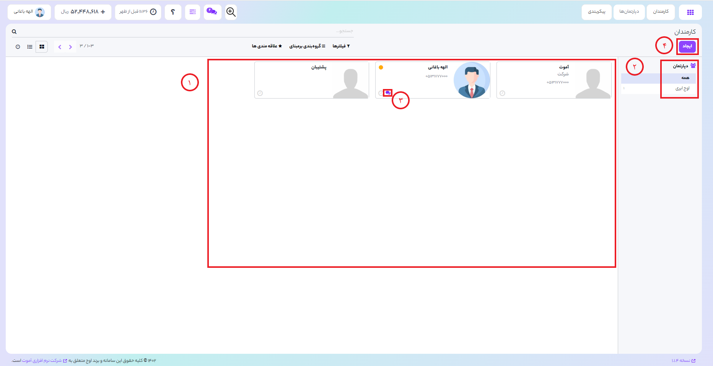
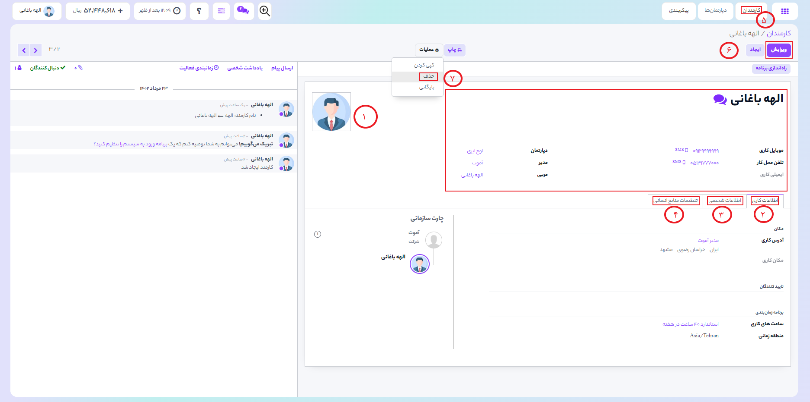
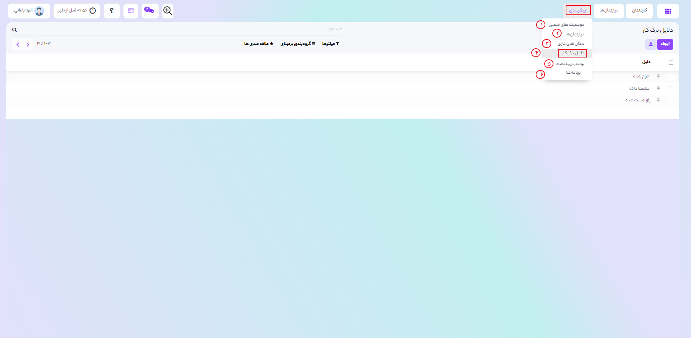
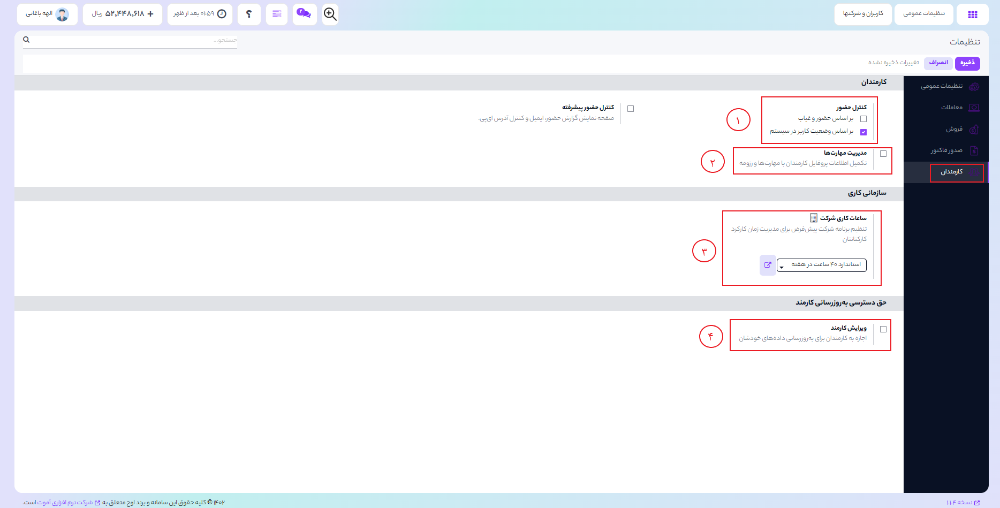

## مااژول کارمندان
برای ایجاد و مدیریت کارمندان سازمان خود ابتدا نیاز است ماژول مخاطبین نصب کنید.
می توانید سلسه مراتب سازمان تان را ایجاد کرده و کارمندان را در زیر بخش های مختلف مطابق با ساختار سازمان خود اضافه کنید.
  

**1.** با ورود به ماژول مخاطبین , لیست کارمندان را مشاهده خواهید کرد همراه با جزییات نام کارمند,موقعیت شغلی و ...

**2.** همچنین به راحتی می توانید کارمند را براساس شرکت و یا دپارتمان محل فعالیتش , فیلتر کنید.

**3.** برای گفت و گو کافیست روی آیکون پیامک هر کاربر کلیک کنید.

**4.** برای ایجاد کارمند جدید, بر روی دکمه
<b>"ایجاد"</b> کلیک کنید:

1) در این قسمت می توانید تمام اطلاعات مهم مربوط به یک کارمند,مانند :نام کارمند,موقعیت شغلی ,برچسب ها مانند کارمند یا مربی ,موبایل, تلفن محل کار و غیره را وارد نمایید.
2)  می توانید در تب **"اطلاعات کاری"** اطلاعات مربوط به کار را اضافه کنید
3) می توانید در تب **"اطلاعات خصوصی"**  کلیه اطلاعات شخصی مربوط به کارمند مانند آدرس شخصی ,وضعیت تاهل,میزان تحصیلات و غیره را وارد کنید.
4)  .در تب **"تنظیمات منابع انسانی"** می توانید نام کاربر مربوط به این کارمند,نوع کارمند و موقعیت شغلی و موارد دیگر را مشخص کنید
5) **به ماژول کارمندان > کارمندان بروید** تا لیست کلیه کارمند ها مشاهده کنید.
6) برروی دکمه **"ویرایش"** کلیک کنید , تا تغییر ات لازم را اعمال کنید.
7) برای حذف کارمند , بر روی دکمه **"عمل"** کلیک کنید و در منوی کشویی بر روی گزینه **"حذف"** کلیک نمایید.

## پیکربندی

1)  به **ماژول کارمندان > پیکربندی > موقعیت شغلی بروید:**
در این قسمت می توانید نام موقعیت شغلی جدید , شرکتی که در آن موقعیت ایجاد می شود, محل کار و شرح شغلی , کارمندان جدید پیش بینی شده , فرم مصاحبه و موارد دیگر را وارد کنید.
2) اوج ابری به شما این امکان را می دهد که ساختار سازمانی و سلسه مراتب دپارتمان های خود را به راحتی ایجاد و مدیریت کنید.
3) می توانید مکان کاری جدید همراه با آدرس ثبت نمایید.
4) در این تب می توانید دلایل ترک کار با عناوین مختلف تعریف کنید.
5) این فعالیت ها می تواند به کارمندان کمک کند تا خودشان را زودتر با شرکت وفق دهند. با قابلیت برنامه ریزی در اوج برای کارمندان می توان نقش موثری در آماده سازی کارکنان انجام شود. می توانید با اشتراک گذاشتن کتاب راهنما سازمان /دستور عمل ها و منابع دیگر,داده ها را به کارمندان داد.
  
## تنظیمات 

برای دسترسی به تنظیمات , به 
**ماژول کارمندان > پیکرمندی > تنظیمات > تب کارمندان بروید.**
1) کنترول حضور و غیاب کارمند می تواند براساس حضور و غیاب/براساس وضعیت کاربر و یا هر دو در سیستم باشد.
2)  بافعال سازی گزینه **"مدیریت مهارت ها"** , می توانید در پروفایل کارکنان , مهارت ها و رزومه های آنها را نمایش دهید.
3) با فعال کردن گزینه دسترسی **"ویرایش کارمند"** , کارمندان مربوطه می توانند داده های خود را در داشبورد کاربریشان ویرایش و به روز رسانی کنند.
4) زمان بندی ساعات کاری شرکت را می توان از منوی کشویی **"ساعات کاری شرکت"** تنظیم کرد.