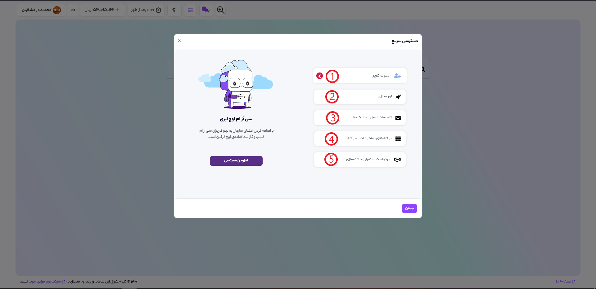
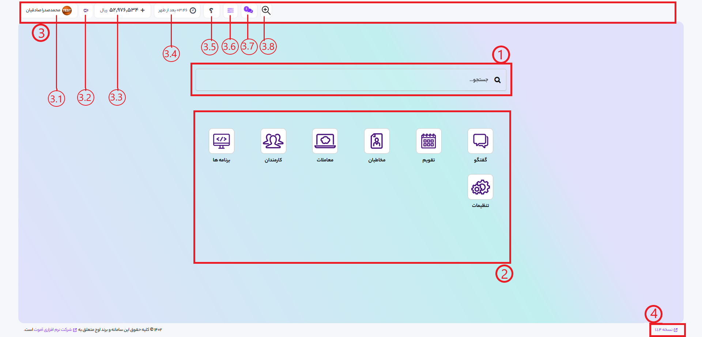

# منوی دسترسی سریع

هر زمانی که به داخل برنامه وارد شوید، منوی دسترسی سریع برای شما باز میشود.  این منو برای دسترسی به عملیات های پراستفاده در سیستم ایجاد شده است. در تصویر زیر گزینه های موجود در دسترسی سریع را میبینید که در ادامه به توضیح آنها میپردازیم. 
 

### 1- دعوت کاربر:
برای دسترسی سریع به بخش دعوت کاربر به سیستم
### 2- تور مجازی:
با انتخاب کردن و فعال کردن این گزینه با توجه به مکان شما در برنامه، یک تور آموزشی سیستم اجرا میشود.
### 3- تنظیمات ایمیل و پیامک ها:
با این گزینه میتوانید به بخش تنظیمات مربوط به سامانه پیامکی و ایمیل سرور خود بروید
### 4- برنامه های بیشتر و نصب برنامه:
در این بخش میتوانید به صفحه نصب برنامه های بیشتر و نمایش تمام برنامه های موجود بروید
### 5- درخواست استقرار و پیاده سازی:
برای ارتباط با پشتیبانان و کارشناسان سیستم

***
 

# منوی اصلی 

منوی اصلی برای دسترسی به تمام برنامه های نصب شده و یا برنامه های پیش فرض سیستم میباشد.  

 
### 1- جستوجو :
به کمک این بخش میتوانید تنها با نوشتن نام یک برنامه، یک منو یا زیر منوی آن ، به آن دسترسی پیدا کنید.
### 2- برنامه ها :
تمامی برنامه های نصب شده شما در این بخش نشان داده میشوند
### 3- منوی نوبار (navbar) :
در منوی نوبار موارد مختلفی وجود داره که به توضیح چند مورد از آنها میپردازیم.
#### 3.1- ناحیه کاربری : این قسمت دارای گزینه های مختلفی در رابطه با کاربر از جمله پروفایل، میانبر ها و دکمه خروج میباشد
#### 3.2- فعال ساز استودیو اوج ابری : در صورتی که ماژول استودیو اوج ابری نصب باشد، کلیک برروی این گزینه باعث فعال شدن آن میشود. 
#### 3.3- موجودی حساب : این گزینه موجودی حساب ادمین سیستم را نشان میدهد. با کلیک برروی آن میتوانید از وضعیت پکیج خریداری شده مطلع شوید و یا اقدام به ارتقای آن نمایید. همچنین میتوانید برای افزایش شارژ حساب خود اقدام کنید.
#### 3.4- ساعت : نمایش ساعت دقیق 
#### 3.5- پشتیبانی و سوالات متداول : در این بخش میتوانید به پشتیبانی و سوالات متداول دسترسی پیدا کنید. همچنین منوی دسترسی سریع نیز از این بخش قابل دسترسی است. 
#### 3.6- فعالیت ها : این منوی لیست تمام فعالیت های نسبت داده شده به شما را با جزییات نشان میدهد. 
#### 3.7- گفتگو ها :این قسمت لیست تمام گفتگو های اخیر شما را نمایش میدهد که میتوانید با کلیک برروی هر کدام صفحه گفتگو را باز کنید. 
#### 3.8- تنظیم کننده زوم صفحه : این گزینه برای تغییر زوم صفحه در لیست ها و فرم هاست.
### 4- ورژن :
در این بخش ورژن نهایی اوج ابری نمایش داده خواهد شد. با کلیک برروی ورژن شما به صفحه تغییرات آن ورژن هدایت خواهید شد.
***
 

