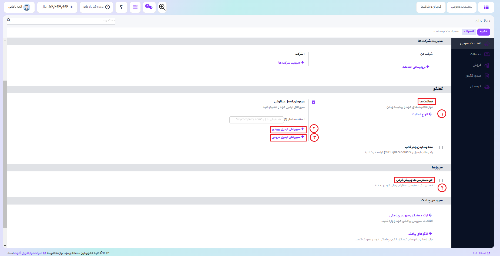

# گفتگو و مجوز ها

1) در اوج ابری شما می توانید فعالیت های مختلف تعریف کنید ،به عنوان مثال یک قرارداد تعریف کنید کاذبران پیش فرض خود را اضافه کنید زمان بندی برای فعالیت خود درنظر بگیرید و به این ترتیب لیست فعالیت های خود را مشاهد ه کنید.
2) **نحوه مدیریت سرور های ایمیل ورودی**
 با کلیک بر روی گزینه **سرور های ایمیل ورودی** شما می توانید برای هر نام مستعار یک سرور ایمیل ورودی در اوج ایجاد کنید.
3) **نحوه مدیریت سرور های ایمیل خروجی**
 گزینه ایمیل خروجی انتخاب کنید و بر روی ایجاد کلیک کنید تا میل سرور خروجی جدید و داده های SMTP مربوط به میل سرور ایجاد گردد.پس از پر کردن اطلاعات مورد نیاز با اطلاعات خود بر روی گزینه **تست برقراری ارتباط**کلیک کنید.سپس نام دامنه ایمیل خود را در تنظیمات عمومی تنظیم نمایید.
4) در این قسمت می توانید قوانین سطوح دسترسی تعریف کرد و کاربر می تواند براساس سطوح دسترسی ،به سیستم و ماژول های مختلف دسترسی داشته باشد.