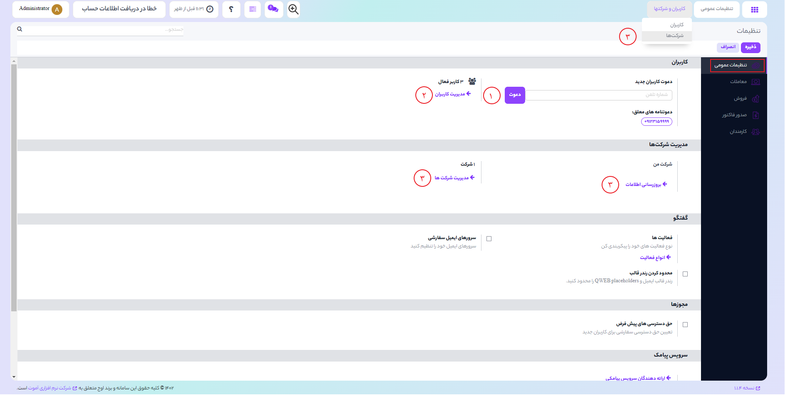
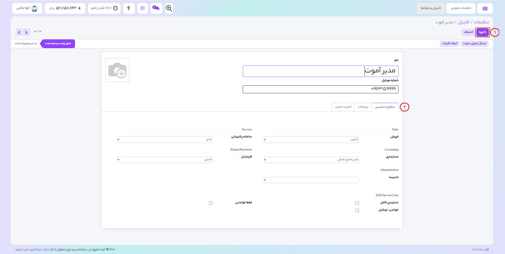
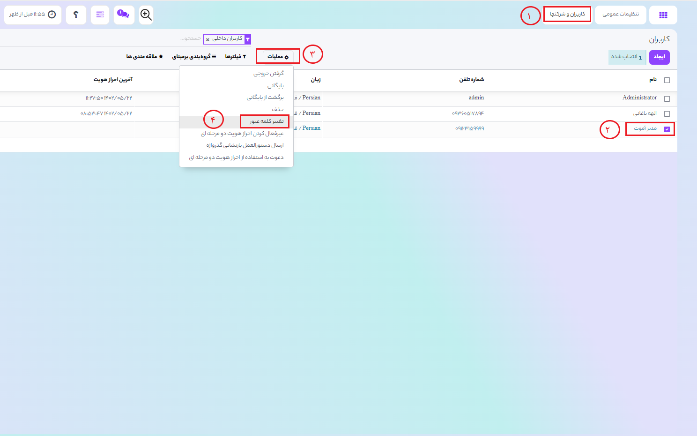
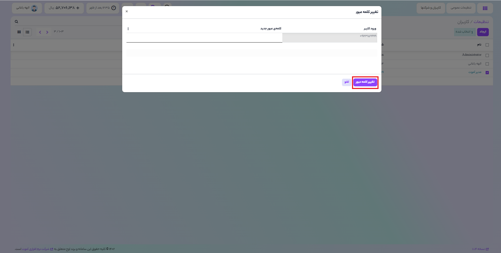

# تنظیمات
در اوج شما می توانید به تعداد مورد نیاز کاربر اضافه کنید کاربران برای انجام کلیه کار ها به پایگاه داده دسترسی دارند.

## افزودن کاربران:

### 1) به <b>تنظیمات عمومی >  دعوت کاربران جدید</b> 
بروید و شماره تلفن کاربر جدید را در کادر شماره تلفن وارد کنید و بر روی دکمه "دعوت" کلیک کنید.

 به این ترتیب برای کاربری که شماره آن را وارد کردید دعوتنامه ای از طریق پیامک ارسال میشود که حاوی لینک ورود کاربر به صفحه ورود اوج می باشد. 

### 2) به <b>تنظیمات عمومی > کاربران > مدیریت کاربران بروید </b>
و بر روی دکمه
<b>"ایجاد"</b>
کلیک کنید.

### 3) <b> به ماژول تنظیمات > کاربران و شرکتها بروید</b>
برای افزودن اطلاعات و یا تغییر اطلاعات ثبت شده
برای انجام این عملیات میتوانید از دو روش دیگر هم استفاده کنید
سپس شرکت مورد نظر را انتخاب کرده و بر روی دکمه 
<b>"ویرایش"</b>
کلیک نمایید.
سپس می توانید اطلاعات جدید مانند آدرس,تلفن,ایمیل و سایر اطلاعات ثبت کنید و در انتها بر روی دکمه "ذخیره" کلیک کنید.

***

### 1) ابتدا نام کاربر جدید و سپس شماره همراه کاربر را وارد کنید
 هنگامی که شما عملیات صفحه را انجام دادید بر روی دکمه "ذخیره" کلیک کنید تا پیامک عضویت برای کاربر ارسال شود.

می توانید برای کاربر یک تصویر اضافه کنید و یا در صورتی که کاربر حساب آموت اکانت داشته باشد عکس کاربر به صورت خودکار در این قسمت به روزرسانی می شود.

### 2)در تب <b>سطوح دسترسی</b>  
گروه و برنامه هایی که این کاربر می تواند به آن دسترسی داشته باشد و استفاده کند را انتخاب نمایید

برنامه های نشان داده شده  براساس برنامه های نصب شده بر روی 
پایگاه داده است.

***

## تغییر کلمه عبور:

### 1) ابتدا به <b>ماژول تنظیمات > کاربران و شرکتها> کاربران </b>بروید
### 2) نام کاربری خود را از لیست انتخاب کنید
### 3) سپس از زیر منوی کشویی عملیات
### 4)بر روی گزینه "تغییر رمز عبور" کلیک کنید

رمز عبور جدید خود را در صفحه باز شده وارد نمایید و سپس بر روی دکمه 
<b>"تغییر رمز عبور" </b>
کلیک نمایید.
