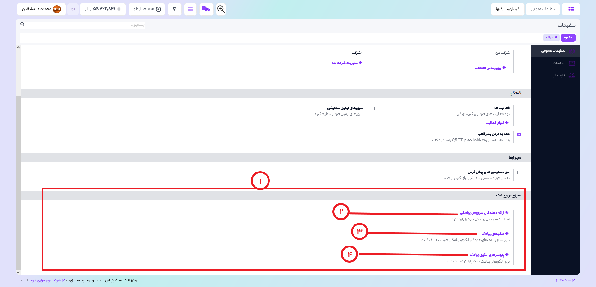

# تنظیمات سرویس پیامک

در قسمت تنظیمات، بخش سرویس پیامک میتوانید تنظیمات مربوط به سرویس پیامکی خودتان را انجام بدهید .

1) ارائه دهندگان سرویس پیامکی:
    تمام این بخش مربوط به تنظیمات سرویس پیامکی شما میباشد.
2) برای اضافه کردن سرویس های پیامکی خود میتوانید از این بخش استفاده کنید. به طوری که اطلاعات حساب خود را وارد کرده و از ان پس اوج ابری از ان برای اتصال به سرویس پیامکی شما استفاده میکند.
3) الگو های پیامکی برای ارسال پیامک های خودکار استفاده میشود به طوریکه شما باید یک الگو با متن ها و متغیر هایش را مشخص کنید و از آن پس طبق الگوی تعریف شده میتواند به طور خودکار پیامک ارسال کنید.
4) برای تعریف متغیر های مختلف در الگو های پیامکی خود میبایستی ابتدا آن هارا در این قسمت تعریف کنید تا الگوهای پیامکی شما بتوانند از ان استفاده کنند.

