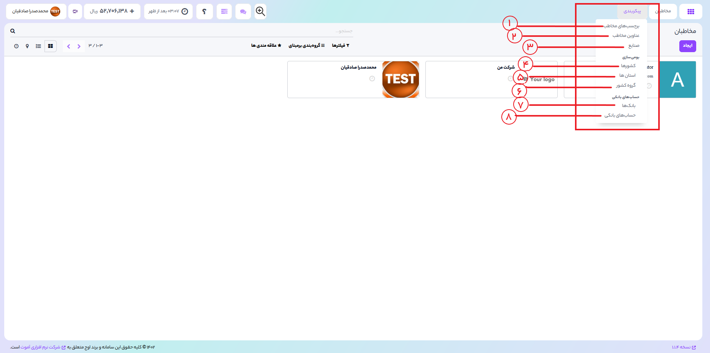

## مااژول مخاطبین
برای هر سازمانی مدیریت مخاطبین امری بسیار ضروری است .
 ماژول مخاطبین اوج ابری نشان دهنده اطلاعاتی با کیفیت درباره مشتریان , همکاران و مخاطبین است .
 برای کار با این ماژول ابتدا نیاز است ماژول مخاطبین را از برنامه های اوج ابری نصب کنید.
 سپس پس از ورود به ماژول مخاطبین برای ایجاد مخاطب جدید کافیست,
### 1)
 بر روی دکمه
<b>"ایجاد"</b>
کلیک کنید

###  2)
دراین قسمت شما می توانید گزینه های "فیلترها" و "گروه بندی بر مبنای" و "علاقه مندی ها" مشاهده کنید.
برای مرتب سازی سریع داده های مورد نیاز , از فیلترهای قدرتمند که در بالای صفحه قرار دارند استفاده کنید.
با استفاده از گزینه 
<b>"گروه بندی بر مبنای",</b>
می توانید مخاطبین را براساس فروشنده,شرکت,کشور به راحتی گروه بندی کنید.
 از طریق کلیک بر روی
<b>"افزودن گروه سفارشی",</b>
می توانید پارامترهای جدیدی را برای فیلتر کردن داده ها وارد کنید.

### 3)
شما قادر خواهید بود 
حالت نمایش نما را به فرم دلخواه تغییر دهید 
فعالیت های خود را مدیریت کنید و آدرس مخاطبین را بر روی نقشه مشاهده کنید
### 4)
با ورود به ماژول مخاطبین اوج ابری , مخاطبین موجود در سیستم را در این قسمت مشاهده خواهید کرد.

  

1) می توانید برچسب های که به هر مخاطب تخصیص می دهید در اینجا مدیریت کنید برچسب جدید تعریف کنید و برای آن رنگ جدید انتخاب کرد
2) عناوین مخاطب هایی که تعریف کردید را می توانید در این قسمت مشاهده کنید و عناوین جدید برای مخاطبین خود ایجاد کنید.
3) می توانید برای مخاطبین خود با توجه به حوزه فعالیت آنها صنایع تعریف کنید.
4) تمامی کشورها تعریف شده در سیستم در اینجا می توانید مشاهده کنید و همچنین خروجی اکسل از لیست کشورها تهیه کنید. 
5) لیست استان ها تعریف شده را می توانید مشاهده کنید و استان جدید اضافه کنید و همچنین خروجی اکسل از لیست استان ها تهیه کنید.
6) در این قسمت گروه کشور ها تعریف شده وجود دارند.
7) لیست بانکهای تعریف شده برای مخاطبین با کد شناسه بانک در این قسمت ذخیره می شوند.
8) جهت مدیریت شماره حساب های بانکی به این قسمت مراجعه کنید.
  

### 1)
شما می توانید تمامی اطلاعات اساسی مربوط به مخاطب مانند:
نام مخاطب - آدرس - شماره تماس - ایمیل - عکس و ... اضافه کرد.
### 2)
براساس اوج ابری شما دو نوع مخاطب دارید: 
 
<b>فردی و شرکتی</b>
### 3 )
در این قسمت تب های وجود دارد که با نصب ماژول های بیشتر اوج ابری به تعداد تب ها اضافه می شوند
مانند ماژول فروش اوج ابری ,حسابداری , ماژول گفت و گو , جلسات و ...
 با کلیک روی هر گزینه به تب مربوطه به آن ماژول هدایت خواهید شد.

###  4)
در اینجا جزییات تغییرات ,کلیه عملیاتی که انجام می دهید را نمایش می دهد. 

###  5)
در انتها با کلیک بر روی دکمه 
<b>"ذخیره" </b>
اطلاعات مخاطب ذخیره کنید و یا می توانید از انجام ادامه عملیات 
<b>"انصراف" </b>دهید.