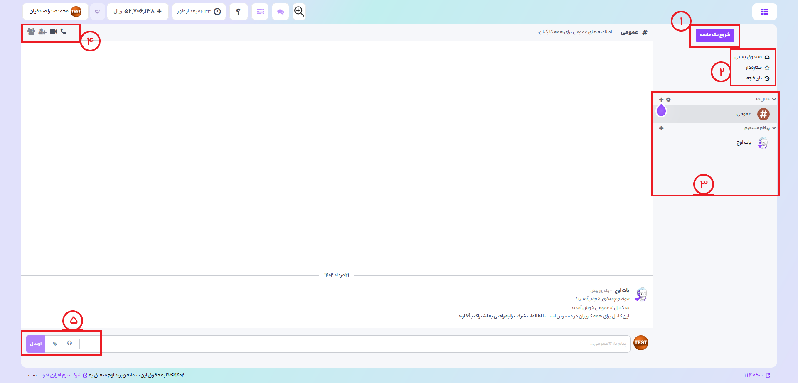
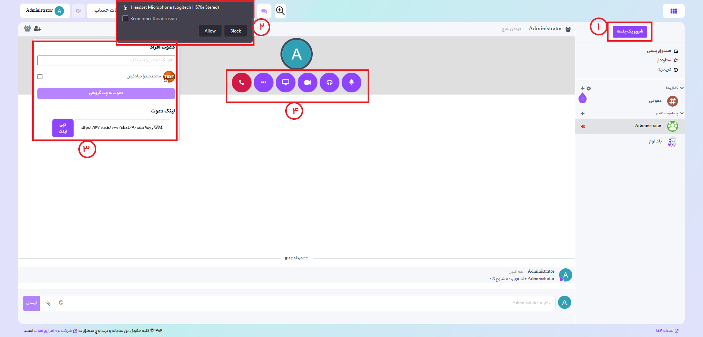

# ماژول گفتگو

مناسب برای انتقال اطلاعات، پیام به همتیمی، برقراری جلسات آنلاین به صورت صوتی و تصویری

1) با کلیلک برروی این گزینه شما میتوانید یک جلسه آنلاین را شروع کنید و با به اشتراک گذاشتن لینک آن، از بقیه افراد دعوت به عمل اورید.
2) در این بخش شما به صندوق پستی ایمیل خود، پیام های ستاره دار که خودتان انتخاب کردید و تاریخچه عملیات ها دسترسی دارید.
3) در این بخش لیست تمام کانال ها و گفتوگو های خود را مشاهده میکنید و میتوانید با انتخاب هرکدام به آن وارد شوید.
4) زمانیکه به یک کانال یا یک گفتگو وارد میشوید میتوانید به کمک این گزینه های تماس صوتی یا تصویری ایجاد کنید و افراد دیگر را نیز جهت حضور در آن دعوت کنید.
5) به کمک گزینه های موجود میتوانید برای پیام خود ایموجی انتخاب کنید یا یک فایل به آن پیوست کنید.

## شروع جلسه آنلاین 
 با کلیک بر روی گزینه **شروع یک جلسه**، میتوانید جلسه آنلاین ایجاد کنید که در ادامه به توضیحات بخش های آن میپردازیم.
 

1) در ابتدا روی این گزینه کلیک میکنیم تا جلسه زنده اغاز شود
2) در صورتی که تابحال از قابلیت جلسه آنلاین اوح ابری استفاده نکرده باشید، یک درخواست جهت اعطای دسترسی به میکروفون و دوربین توسط مرورگر برای شما ارسال میشود که باید گزینه allow را انتخاب کنید.
3) در این قسمت شما میتوانید اعضای جلسه را دعوت کنید و به آنها درخواست شرکت در جلسه را بدهید. درصورتی که فرد مورد نظر در اوج ابری حساب کاربری دارد شما میتوانید با نوشتن نام ان فرد ، او را به جلسه دعوت کنید. در صورتی هم که فرد مورد نظر در اوج ابری حساب کاربری ندارد شما میتوانید با به اشتراک گذاشتن لینک جلسه از او دعوت کنید تا به عنوان مهمان به جلسه شما بپیوندد.
4) در این بخش هم کلید های مربوط به مدیریت جلسه و تنظیمات تماس مشاهده میکنید. این کلید ها شامل: قطع تماس، اشتراک گذاری صفحه نمایش، روشن و خاموش کردن دوربین و میکروفون و تنظیمات صفحه جلسه میباشند.
